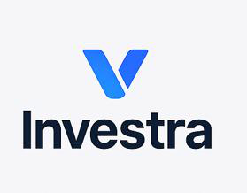
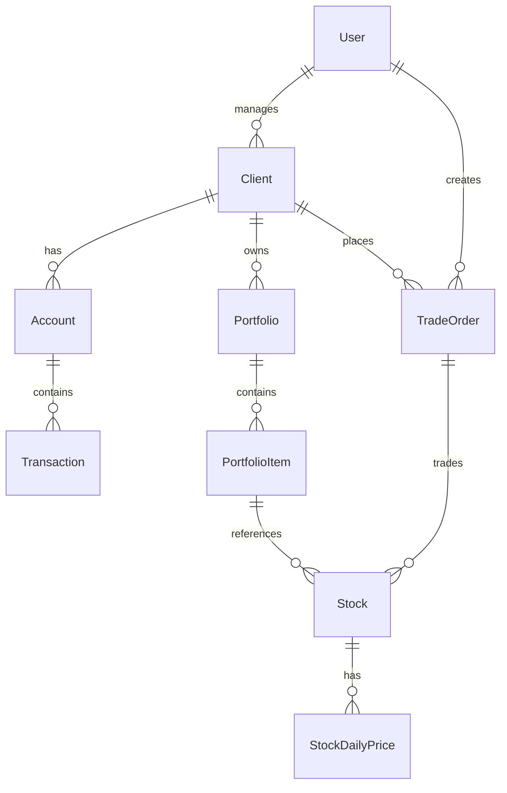

# 🚀 Investra - Yatırım Platformu

<div align="center">



**Modern, Güvenli ve Ölçeklenebilir Yatırım Yönetim Sistemi**

[](https://openjdk.java.net/projects/jdk/17/)
[](https://spring.io/projects/spring-boot)
[](https://nextjs.org/)
[](https://www.typescriptlang.org/)
[](https://www.docker.com/)
[](LICENSE)

[📖 Dokümantasyon](#-dokümantasyon) • [🚀 Hızlı Başlangıç](#-hızlı-başlangıç) • [🏗️ Mimari](#️-mimari) • [🔧 API](#-api) • [📱 Frontend](#-frontend) • [🐳 DevOps](#-devops)

</div>

---

## 📋 İçindekiler

- [Proje Hakkında](#-proje-hakkında)
- [Özellikler](#-özellikler)
- [Teknoloji Stack](#-teknoloji-stack)
- [Mimari](#️-mimari)
- [Kurulum](#-kurulum)
- [API Dokümantasyonu](#-api-dokümantasyonu)
- [Frontend](#-frontend)
- [DevOps & Monitoring](#-devops--monitoring)
- [Güvenlik](#-güvenlik)
- [Test](#-test)
- [Katkıda Bulunma](#-katkıda-bulunma)
- [Lisans](#-lisans)

---

## 🎯 Proje Hakkında

**Investra**, modern finansal teknolojiler kullanarak geliştirilmiş, kapsamlı bir yatırım yönetim platformudur. Sistem, bireysel ve kurumsal müşteriler için hisse senedi alım-satım, portföy yönetimi, hesap yönetimi ve risk analizi gibi temel yatırım hizmetlerini sunar.

### 🎯 Ana Hedefler

- **Güvenli İşlem**: End-to-end şifreleme ve JWT tabanlı kimlik doğrulama
- **Gerçek Zamanlı Veri**: Canlı hisse senedi fiyatları ve portföy değerlemesi
- **Kullanıcı Dostu**: Modern ve responsive web arayüzü
- **Compliance**: Finansal düzenlemelere uygun işlem kayıtları

---

## ✨ Özellikler

### 🔐 Kimlik Doğrulama & Yetkilendirme
- **JWT Token** tabanlı güvenli oturum yönetimi
- **Role-based Access Control** (ADMIN, TRADER, USER)
- **Şifre sıfırlama** ve güvenlik politikaları
- **Multi-factor authentication** desteği

### 👥 Müşteri Yönetimi
- **Bireysel Müşteri** kayıt ve profil yönetimi
- **Kurumsal Müşteri** hesap yönetimi
- **KYC/AML** uyumlu müşteri doğrulama
- **Risk profili** değerlendirmesi

### 💰 Hesap & Portföy Yönetimi
- **Çoklu para birimi** desteği (TRY, USD, EUR)
- **Yatırım ve takas** hesabı ayrımı
- **Gerçek zamanlı portföy** değerlemesi
- **Günlük portföy** performans takibi

### 📈 Hisse Senedi İşlemleri
- **Market ve Limit** emir türleri
- **Gerçek zamanlı fiyat** güncellemeleri
- **T+2 takas** sistemi simülasyonu
- **Emir geçmişi** ve durum takibi

### 📊 Raporlama & Analitik
- **İşlem geçmişi** raporları
- **Portföy performans** analizi
- **Risk metrikleri** hesaplama
- **Excel/PDF** export desteği

### 🔔 Bildirim Sistemi
- **Email bildirimleri** (SMTP)
- **İşlem durumu** güncellemeleri
- **Portföy değişiklik** uyarıları
- **Sistem bakım** bildirimleri

---

## 🏗️ Teknoloji Stack

### Backend
- **Java 17** - Modern Java özellikleri
- **Spring Boot 3.5.4** - Enterprise framework
- **Spring Security** - Güvenlik ve kimlik doğrulama
- **Spring Data JPA** - Veritabanı işlemleri
- **Spring Cache** - Performans optimizasyonu
- **Hibernate** - ORM framework

### Frontend
- **Next.js 15.4.4** - React tabanlı full-stack framework
- **TypeScript 5.0** - Tip güvenli JavaScript
- **Tailwind CSS** - Utility-first CSS framework
- **Radix UI** - Accessible component library
- **React Hook Form** - Form yönetimi
- **TanStack Table** - Veri tablosu bileşenleri

### Veritabanı & Cache
- **Microsoft SQL Server** - Ana veritabanı
- **Redis** - In-memory cache ve session store
- **Caffeine** - Local cache (Spring Boot)

### DevOps & Monitoring
- **Docker & Docker Compose** - Containerization
- **Prometheus** - Metrik toplama
- **Grafana** - Metrik görselleştirme
- **Spring Boot Actuator** - Application monitoring

### Güvenlik
- **JWT** - Stateless authentication
- **BCrypt** - Şifre hashleme
- **CORS** - Cross-origin resource sharing
- **Rate Limiting** - API güvenliği

---

## 🏛️ Mimari

### Backend Mimari

```
src/main/java/com/investra/
├── config/           # Konfigürasyon sınıfları
├── controller/       # REST API endpoint'leri
├── service/          # İş mantığı katmanı
│   ├── impl/        # Servis implementasyonları
│   └── helper/      # Yardımcı servisler
├── repository/       # Veri erişim katmanı
├── entity/          # JPA entity'leri
├── dto/             # Data Transfer Objects
├── mapper/          # Entity-DTO dönüşümleri
├── security/        # Güvenlik konfigürasyonu
├── exception/       # Özel exception'lar
├── enums/           # Enumeration'lar
└── utils/           # Yardımcı sınıflar
```

### Frontend Mimari

```
investra-frontend/
├── app/             # Next.js App Router
│   ├── api/         # API route'ları
│   ├── auth/        # Kimlik doğrulama sayfaları
│   └── dashboard/   # Dashboard sayfaları
├── components/      # React bileşenleri
│   ├── ui/         # Temel UI bileşenleri
│   └── dashboard/  # Dashboard özel bileşenleri
├── hooks/          # Custom React hooks
├── lib/            # Yardımcı fonksiyonlar
└── types/          # TypeScript tip tanımları
```

### Veri Modeli



---

## 🚀 Kurulum

### Ön Gereksinimler

- **Java 17** veya üzeri
- **Maven 3.6+**
- **Node.js 18+** ve **npm**
- **Docker** ve **Docker Compose**
- **Microsoft SQL Server** (veya Docker container)

### 1. Repository Klonlama

```bash
git clone https://github.com/your-username/investra.git
cd investra
```

### 2. Backend Kurulumu

```bash
# Maven dependencies yükleme
mvn clean install

# Uygulamayı çalıştırma
mvn spring-boot:run
```

### 3. Frontend Kurulumu

```bash
cd investra-frontend

# Dependencies yükleme
npm install

# Development server başlatma
npm run dev
```

### 4. Docker ile Kurulum

```bash
# Environment variables ayarlama
cp .env.example .env
# .env dosyasını düzenleyin

# Tüm servisleri başlatma
docker compose up -d

# Logları izleme
docker compose logs -f
```

### 5. Environment Variables

```env
# Database
DB_USERNAME=your_username
DB_PASSWORD=your_password
DATABASE_URL=jdbc:sqlserver://localhost:1433;databaseName=investra

# JWT
JWT_SECRET=your_super_secret_jwt_key_here

# Email
MAIL_USERNAME=your_email@gmail.com
MAIL_PASSWORD=your_app_password

# Frontend
FRONTEND_URL=http://localhost:3000

# External APIs
INFINA_API_KEY=your_api_key
INFINA_API_URL=https://api.infina.com.tr
```

---

## 🔌 API Dokümantasyonu

### Base URL
```
http://localhost:8088/api/v1
```

### Authentication Endpoints

#### 🔐 Giriş
```http
POST /auth/login
Content-Type: application/json

{
  "email": "user@example.com",
  "password": "password123"
}
```

#### 🔑 Şifre Değiştirme
```http
POST /auth/change-password
Authorization: Bearer {JWT_TOKEN}
Content-Type: application/json

{
  "currentPassword": "oldPassword",
  "newPassword": "newPassword123",
  "confirmPassword": "newPassword123"
}
```

#### 📧 Şifre Sıfırlama
```http
POST /auth/forgot-password?email=user@example.com
```

### Müşteri Yönetimi

#### 👤 Müşteri Oluşturma
```http
POST /clients/create
Authorization: Bearer {JWT_TOKEN}
Content-Type: application/json

{
  "clientType": "INDIVIDUAL",
  "email": "client@example.com",
  "phone": "+905551234567",
  "fullName": "John Doe",
  "nationalityNumber": "12345678901",
  "birthDate": "1990-01-01"
}
```

#### 🔍 Müşteri Arama
```http
POST /clients/find
Authorization: Bearer {JWT_TOKEN}
Content-Type: application/json

{
  "searchType": "NATIONALITY_NUMBER",
  "searchValue": "12345678901"
}
```

### Hisse Senedi İşlemleri

#### 📈 Alış Emri
```http
POST /stocks/buy
Authorization: Bearer {JWT_TOKEN}
Content-Type: application/json

{
  "stockCode": "THYAO",
  "quantity": 100,
  "price": 45.50,
  "orderType": "LIMIT",
  "executionType": "LIMIT"
}
```

#### 📉 Satış Emri
```http
POST /stocks/sell
Authorization: Bearer {JWT_TOKEN}
Content-Type: application/json

{
  "stockCode": "THYAO",
  "quantity": 50,
  "price": 46.00,
  "orderType": "MARKET",
  "executionType": "MARKET"
}
```

### Emir Yönetimi

#### 📋 Emir Listesi
```http
GET /trade-orders/all
Authorization: Bearer {JWT_TOKEN}
```

#### ⏳ Bekleyen Emirler
```http
GET /trade-orders/pending
Authorization: Bearer {JWT_TOKEN}
```

#### ✅ Gerçekleşen Emirler
```http
GET /trade-orders/executed
Authorization: Bearer {JWT_TOKEN}
```

### Response Format

```json
{
  "statusCode": 200,
  "message": "İşlem başarılı",
  "data": {
    // Response data
  },
  "errorCode": null,
  "timestamp": "2024-01-15T10:30:00Z"
}
```

---

## 📱 Frontend

### Teknolojiler

- **Next.js 15** - App Router ve Server Components
- **TypeScript** - Tip güvenliği
- **Tailwind CSS** - Modern CSS framework
- **Radix UI** - Accessible component library
- **React Hook Form** - Form yönetimi
- **TanStack Table** - Veri tabloları

### Sayfa Yapısı

```
/                    # Ana sayfa
/auth/login          # Giriş
/auth/forgot-password # Şifre sıfırlama
/auth/reset-password  # Şifre yenileme
/dashboard           # Ana dashboard
/dashboard/customer-management # Müşteri yönetimi
/dashboard/employee-management # Çalışan yönetimi
/dashboard/stock-operations    # Hisse işlemleri
```

### Component Yapısı

- **AppSidebar** - Ana navigasyon
- **CustomerTable** - Müşteri listesi
- **EmployeeTable** - Çalışan listesi
- **AddCustomerDialog** - Müşteri ekleme
- **EditUserDialog** - Kullanıcı düzenleme

### State Management

- **React Context** - Global state
- **Custom Hooks** - Business logic
- **Server State** - API data management

---

## 🐳 DevOps & Monitoring

### Container Orchestration

```yaml
services:
  app:          # Spring Boot Application
  redis:        # Cache Service
  prometheus:   # Metrics Collection
  grafana:      # Metrics Visualization
```

### Monitoring Stack

- **Prometheus** - Metrik toplama (15s interval)
- **Grafana** - Dashboard ve alerting
- **Spring Boot Actuator** - Application metrics
- **Custom Health Checks** - Service monitoring

### Logging

- **Structured Logging** - JSON format
- **Log Levels** - DEBUG, INFO, WARN, ERROR
- **Log Rotation** - Daily log files
- **Centralized Logging** - Docker logs

### Performance Metrics

- **JVM Metrics** - Memory, CPU, GC
- **Database Metrics** - Connection pool, query performance
- **Cache Metrics** - Hit/miss ratios
- **Business Metrics** - Transaction volume, user activity

---

## 🔒 Güvenlik

### Authentication & Authorization

- **JWT Token** - Stateless authentication
- **Role-based Access Control** - Fine-grained permissions
- **Password Policies** - BCrypt hashing
- **Session Management** - Secure token handling

### API Security

- **CORS Configuration** - Cross-origin restrictions
- **Rate Limiting** - DDoS protection
- **Input Validation** - SQL injection prevention
- **HTTPS Enforcement** - Transport security

### Data Protection

- **Encryption at Rest** - Database encryption
- **Encryption in Transit** - TLS/SSL
- **Audit Logging** - User activity tracking
- **Data Masking** - Sensitive information protection

---

## 🧪 Test

### Test Stratejisi

- **Unit Tests** - JUnit 5 + Mockito
- **Integration Tests** - Spring Boot Test
- **API Tests** - Postman collections
- **Frontend Tests** - Jest + React Testing Library

### Test Coverage

```bash
# Backend test coverage
mvn test jacoco:report

# Frontend test coverage
npm run test:coverage
```

### Test Data

- **Test Database** - H2 in-memory database
- **Mock Services** - External API simulation
- **Test Users** - Pre-configured test accounts
- **Sample Data** - Realistic test scenarios

---

## 🚀 Deployment

### Production Environment

```bash
# Production build
mvn clean package -Pprod

# Docker image build
docker build -t investra:latest .

# Kubernetes deployment
kubectl apply -f k8s/
```

### Environment Configuration

- **Development** - Local development
- **Staging** - Pre-production testing
- **Production** - Live environment
- **Monitoring** - Production metrics

### Scaling Strategy

- **Horizontal Scaling** - Multiple instances
- **Load Balancing** - Nginx/Traefik
- **Database Scaling** - Read replicas
- **Cache Scaling** - Redis cluster

---

## 🤝 Katkıda Bulunma

### Development Workflow

1. **Fork** the repository
2. **Create** feature branch (`git checkout -b feature/amazing-feature`)
3. **Commit** changes (`git commit -m 'Add amazing feature'`)
4. **Push** to branch (`git push origin feature/amazing-feature`)
5. **Open** Pull Request

### Code Standards

- **Java** - Google Java Style Guide
- **TypeScript** - ESLint + Prettier
- **Git** - Conventional Commits
- **Documentation** - Javadoc + JSDoc

### Testing Requirements

- **Backend** - Minimum 80% test coverage
- **Frontend** - Component and integration tests
- **API** - Postman collection updates
- **Documentation** - README updates

---

## 📚 Dokümantasyon

### API Reference

- **Swagger UI** - `/swagger-ui.html`
- **OpenAPI Spec** - `/v3/api-docs`
- **Postman Collection** - `docs/postman/`

### Architecture Documentation

- **System Design** - `docs/architecture/`
- **Database Schema** - `docs/database/`
- **API Design** - `docs/api/`
- **Deployment** - `docs/deployment/`

### User Guides

- **Admin Guide** - `docs/admin/`
- **Trader Guide** - `docs/trader/`
- **User Guide** - `docs/user/`
- **API Guide** - `docs/api/`

---

## 📄 Lisans

Bu proje **MIT License** altında lisanslanmıştır. Detaylar için [LICENSE](LICENSE) dosyasına bakın.

---

## 📞 İletişim

- **Proje Yöneticisi** - [@project-manager](mailto:manager@investra.com)
- **Teknik Destek** - [@tech-support](mailto:support@investra.com)
- **Güvenlik** - [@security](mailto:security@investra.com)

---

## 🙏 Teşekkürler

Bu proje aşağıdaki açık kaynak projeleri kullanmaktadır:

- [Spring Boot](https://spring.io/projects/spring-boot)
- [Next.js](https://nextjs.org/)
- [Tailwind CSS](https://tailwindcss.com/)
- [Docker](https://www.docker.com/)
- [Prometheus](https://prometheus.io/)
- [Grafana](https://grafana.com/)

---

<div align="center">

**Investra** - Modern Yatırım Teknolojileri

[](https://github.com/your-username/investra)
[](https://github.com/your-username/investra)
[](https://github.com/your-username/investra/issues)

</div>
